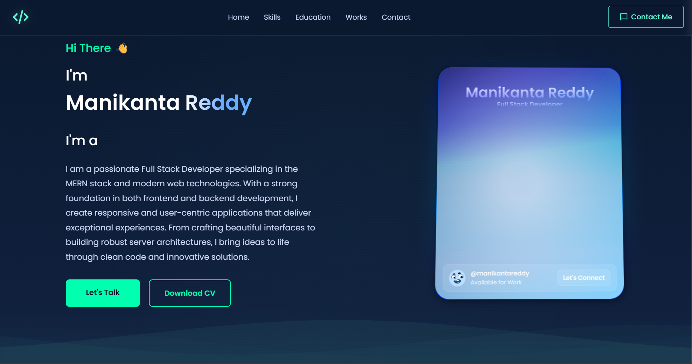

# Modern Portfolio Website

A modern, responsive portfolio website built with React, featuring smooth animations, interactive components, and a beautiful user interface. This portfolio showcases projects, skills, and professional experience in an engaging way.



## 🌟 Features

- **Modern UI/UX**: Clean and professional design with smooth animations
- **Responsive Design**: Fully responsive layout that works on all devices
- **Interactive Components**: 
  - Dynamic project cards with hover effects
  - Modal views for detailed project information
  - Category-based filtering
  - Search functionality
  - Smooth scrolling navigation
- **Sections**:
  - About
  - Education with expandable cards
  - Skills with category filtering
  - Projects/Works showcase
  - Contact form
- **Performance Optimized**:
  - Lazy loading images
  - Optimized animations
  - Efficient state management

## 🚀 Technologies Used

- **Frontend Framework**: React.js
- **Animation**: Framer Motion
- **Styling**: CSS3 with modern features
- **Icons**: React Icons
- **State Management**: React Hooks
- **Build Tool**: Create React App
- **Version Control**: Git
- **Deployment**: Netlify

## 🛠️ Installation & Setup

1. Clone the repository:
   ```bash
   git clone https://github.com/lokireddymanikantaredddy/portfolio
   ```

2. Navigate to the project directory:
   ```bash
   cd portfolio
   ```

3. Install dependencies:
   ```bash
   npm install
   ```

4. Start the development server:
   ```bash
   npm start
   ```

The app will be running at `http://localhost:3000`

## 📦 Build

To create a production build:

```bash
npm run build
```

This will create an optimized build in the `build` folder.

## 🎨 Project Structure

```
src/
├── components/         # React components
│   ├── about/         # About section
│   ├── education/     # Education section
│   ├── skills/        # Skills section
│   ├── works/         # Projects section
│   └── contact/       # Contact section
├── assets/            # Images and static files
├── styles/            # Global styles
└── App.js            # Main app component
```

## 🔧 Customization

1. **Personal Information**: Update `src/components/about/about.js`
2. **Projects**: Modify `src/components/works/projectsData.js`
3. **Skills**: Edit `src/components/skills/skillsData.js`
4. **Education**: Update `src/components/education/educationData.js`
5. **Colors & Styling**: Modify CSS variables in `src/index.css`

## 📱 Responsive Design

The portfolio is fully responsive with breakpoints at:
- Mobile: < 768px
- Tablet: 768px - 1024px
- Desktop: > 1024px

## ✨ Key Features Details

### Projects Section
- Grid layout with hover effects
- Detailed modal view for each project
- Category filtering
- Search functionality
- Responsive image gallery

### Skills Section
- Category-based filtering
- Search functionality
- Animated skill cards
- Progress indicators

### Education Section
- Expandable cards
- Smooth scroll animations
- Responsive layout
- Interactive timeline

## 📄 License

This project is licensed under the MIT License - see the [LICENSE](LICENSE) file for details.

## 🤝 Contributing

Contributions, issues, and feature requests are welcome! Feel free to check [issues page](https://github.com/yourusername/portfolio/issues).

## 📬 Contact

Your Name - [your.email@example.com](mailto:your.email@example.com)

Project Link: [https://github.com/yourusername/portfolio](https://github.com/yourusername/portfolio)

## 🙏 Acknowledgments

- [React.js](https://reactjs.org/)
- [Framer Motion](https://www.framer.com/motion/)
- [React Icons](https://react-icons.github.io/react-icons/)
